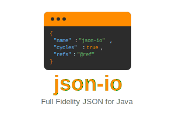

<div align="center">
  

  <p>
    <a href="https://central.sonatype.com/search?q=json-io&namespace=com.cedarsoftware">
      
    </a>
    <a href="http://www.javadoc.io/doc/com.cedarsoftware/json-io">
      
    </a>
    <a href="https://github.com/jdereg/json-io/blob/master/LICENSE">
      
    </a>
    
    <a href="https://json5.org/">
      
    </a>
  </p>

  <p>
    <a href="https://github.com/jdereg/json-io">
      
    </a>
    <a href="https://github.com/jdereg/json-io/fork">
      
    </a>
  </p>
</div>

json-io is a powerful and lightweight Java library that simplifies **JSON5** and JSON serialization and deserialization while handling complex object graphs with ease. Unlike basic JSON parsers, json-io preserves object references, handles polymorphic types, and maintains cyclic relationships in your data structures. Whether you're working with sophisticated domain models, dealing with legacy Java objects, or need high-performance JSON processing, json-io provides a robust solution with minimal configuration.

Key Features:
- Full **JSON5** support including single-line and multi-line comments, single-quoted strings, unquoted object keys, trailing commas, and more — while remaining fully backward compatible with standard JSON (RFC 8259)
- Preserves object references and handles cyclic relationships
- Supports polymorphic types and complex object graphs
- Zero external dependencies (other than java-util)
- Fully compatible with both JPMS and OSGi environments
- Lightweight (`json-io.jar` is ~330K, `java-util` is ~700K)
- Compatible with JDK 1.8 through JDK 24
- The library is built with the `-parameters` compiler flag. Parameter names are now retained for tasks such as constructor discovery.
- Optional unsafe mode for deserializing package-private classes, inner classes, 
  and classes without accessible constructors (opt-in for security)
- Extensive configuration options via `ReadOptionsBuilder` and `WriteOptionsBuilder`
- Two modes: typed Java objects (`toJava()`) or class-independent Maps (`toMaps()`)
- Parse JSON with unknown class references into a Map-of-Maps representation without requiring classes on classpath
- Featured on [json.org](http://json.org)

## JSON5 Support — Complete Spec, Read & Write

json-io provides **full [JSON5](https://json5.org/) specification support** for both reading and writing,
enabled by default with zero configuration.

| Feature | json-io | Jackson | Gson |
|---------|:-------:|:-------:|:----:|
| JSON5 Read | ✅ Full | ⚠️ Partial | ⚠️ Partial |
| JSON5 Write | ✅ Full | ❌ | ❌ |
| Hex Numbers (0xFF) | ✅ | ❌ | ❌ |
| Multi-line Strings | ✅ | ❌ | ❌ |
| Zero Config | ✅ | ❌ | ❌ |

*Jackson and Gson offer lenient/permissive modes that accept some JSON5 read
syntax, but lack hex literals, multi-line strings, and any JSON5 write capability.*

## Cloud Native & Microservices

Optimized for modern cloud deployments and container environments:

- **Zero Transitive Dependencies**: Only depends on java-util, eliminating dependency conflicts in microservices architectures
- **Object Graph Preservation**: Essential for complex domain models in distributed systems - handles cycles and references that break other libraries
- **Container-Ready**: JPMS and OSGi support enables efficient packaging with jlink for minimal container images

## Compatibility

### JPMS (Java Platform Module System)

This library is fully compatible with JPMS, commonly known as Java Modules. It includes a `module-info.class` file that specifies module dependencies and exports.

**JPMS Benefits:**
- Explicit module boundaries for better isolation
- Works with `jlink` for custom JRE builds (<50MB runtime)
- Multi-release JAR with JDK 8 bytecode (class file format 52)

### OSGi

This library also supports OSGi environments. It comes with pre-configured OSGi metadata in the `MANIFEST.MF` file, ensuring easy integration into any OSGi-based application.

**OSGi Compatibility:**
- Compatible with OSGi frameworks (Apache Karaf, Apache Felix, Eclipse Equinox)
- Standard OSGi bundle with proper Import-Package and Export-Package declarations
- Dynamic service loading support

Both of these features ensure that our library can be seamlessly integrated into modular Java applications, providing robust dependency management and encapsulation.

___
To include in your project:
##### Gradle
```groovy
implementation 'com.cedarsoftware:json-io:4.80.0'
```

##### Maven
```xml
 <dependency>
   <groupId>com.cedarsoftware</groupId>
   <artifactId>json-io</artifactId>
   <version>4.80.0</version>
 </dependency>
```

___

## User Guide
>#### [Usage](/user-guide.md)
>#### [WriteOptions reference](/user-guide-writeOptions.md)
>#### [ReadOptions reference](/user-guide-readOptions.md)
>#### [Revision History](/changelog.md)

## Releases
>### 4.80.0
>- [ ] **Version**: [4.80.0](https://www.javadoc.io/doc/com.cedarsoftware/json-io/4.80.0/index.html)
>- [ ] **Bundling**: Both JPMS (Java Platform Module System) and OSGi (Open Service Gateway initiative)
>- [ ] **Maintained**: Fully
>- [ ] **Java Package**: com.cedarsoftware.io
>- [ ] **Java**: JDK1.8+ (Class file 52 format, includes module-info.class - multi-release JAR)
>- [ ] **API**
 >  - Static methods on [JsonIo](https://www.javadoc.io/doc/com.cedarsoftware/json-io/4.80.0/com/cedarsoftware/io/JsonIo.html): [toJson()](https://www.javadoc.io/static/com.cedarsoftware/json-io/4.80.0/com/cedarsoftware/io/JsonIo.html#toJson(java.lang.Object,com.cedarsoftware.io.WriteOptions)), [toJava()](https://www.javadoc.io/doc/com.cedarsoftware/json-io/latest/com/cedarsoftware/io/JsonIo.html#toJava(com.cedarsoftware.io.JsonObject,com.cedarsoftware.io.ReadOptions)), [toMaps()](https://www.javadoc.io/doc/com.cedarsoftware/json-io/latest/com/cedarsoftware/io/JsonIo.html#toMaps(java.lang.String)), [formatJson()](https://www.javadoc.io/static/com.cedarsoftware/json-io/4.80.0/com/cedarsoftware/io/JsonIo.html#formatJson(java.lang.String)), [deepCopy()](https://www.javadoc.io/static/com.cedarsoftware/json-io/4.80.0/com/cedarsoftware/io/JsonIo.html#deepCopy(java.lang.Object,com.cedarsoftware.io.ReadOptions,com.cedarsoftware.io.WriteOptions))
 >  - Use [ReadOptionsBuilder](/user-guide-readOptions.md) and [WriteOptionsBuilder](/user-guide-writeOptions.md) to configure `JsonIo`
 >  - Use [ClassFactory](https://www.javadoc.io/static/com.cedarsoftware/json-io/4.80.0/com/cedarsoftware/io/ClassFactory.html) for difficult classes (hard to instantiate & fill)
 >  - Use [JsonClassWriter](https://www.javadoc.io/static/com.cedarsoftware/json-io/4.80.0/com/cedarsoftware/io/JsonClassWriter.html) to customize the output JSON for a particular class

### Logging

By design, `json-io` limits its dependences to `java-util` and no other libraries, keeping it small and easy to work with.  `json-io` uses the Java built-in `java.util.logging` for all output. See the
[user guide](/user-guide.md#redirecting-javautillogging) for ways to route
these logs to SLF4J or Log4j&nbsp;2.

Featured on [json.org](http://json.org).

For useful Java utilities, check out [java-util](http://github.com/jdereg/java-util)
