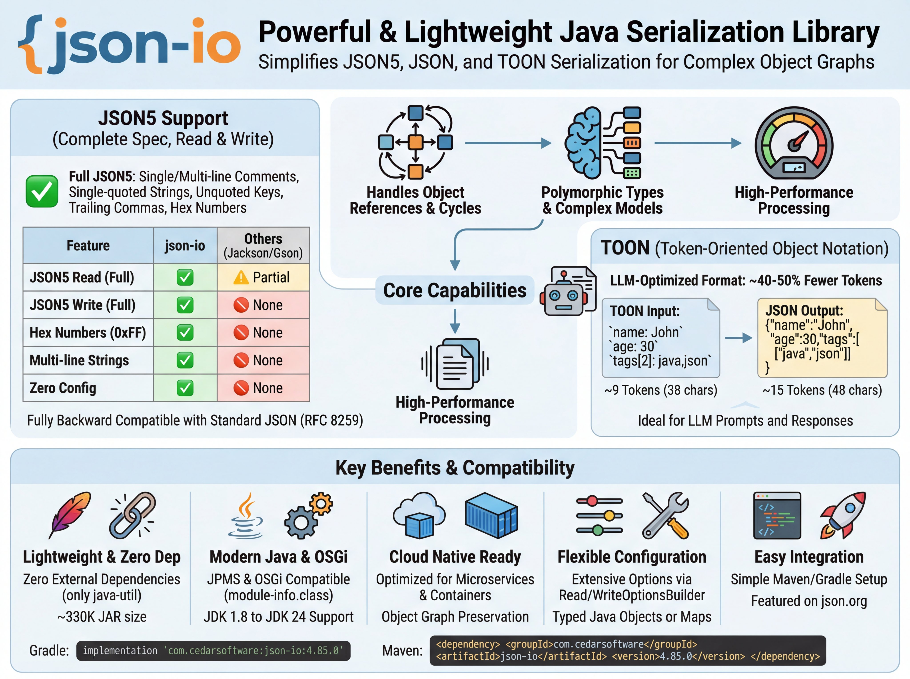

<p align="center">
  
</p>
<p align="right"><sub>Infographic by <a href="https://github.com/glaforge">Guillaume Laforge</a></sub></p>

<div align="center">
  <p>
    <a href="https://central.sonatype.com/search?q=json-io&namespace=com.cedarsoftware">
      
    </a>
    <a href="http://www.javadoc.io/doc/com.cedarsoftware/json-io">
      
    </a>
    <a href="https://github.com/jdereg/json-io/blob/master/LICENSE">
      
    </a>
    
    <a href="https://json5.org/">
      
    </a>
    <a href="https://toonformat.dev/">
      
    </a>
  </p>

  <p>
    <a href="https://github.com/jdereg/json-io">
      
    </a>
    <a href="https://github.com/jdereg/json-io/fork">
      
    </a>
  </p>
</div>

json-io is a powerful and lightweight Java library that simplifies **JSON5**, **JSON**, and **TOON** serialization and deserialization while handling complex object graphs with ease. Unlike basic JSON parsers, json-io preserves object references, handles polymorphic types, and maintains cyclic relationships in your data structures.

## Table of Contents

- [Key Features](#key-features)
- [Why json-io?](#why-json-io)
  - [vs Jackson/Gson](#vs-jacksongson-json)
  - [vs JToon](#vs-jtoon-toon)
  - [What's Coming Next](#whats-coming-next)
- [Installation](#installation)
- [Quick Start](#quick-start)
- [Spring Boot Integration](#spring-boot-integration)
- [Supported Types](#supported-types-60-built-in)
- [Documentation](#documentation)
- [Release Info](#release-4890)
  - [Logging](#logging)

## Key Features

- Full **JSON5** support including single-line and multi-line comments, single-quoted strings, unquoted object keys, trailing commas, and more — while remaining fully backward compatible with standard JSON (RFC 8259)
- **TOON read/write** — [Token-Oriented Object Notation](https://toonformat.dev/) for LLM-optimized serialization (~40-50% fewer tokens than JSON)
- Preserves object references and handles cyclic relationships (use `cycleSupport(false)` for ~35-40% faster writes on acyclic data)
- Supports polymorphic types and complex object graphs
- Zero external dependencies (other than java-util)
- Fully compatible with both JPMS and OSGi environments
- Lightweight (`json-io.jar` is ~330K, `java-util` is ~700K)
- Compatible with JDK 1.8 through JDK 24
- The library is built with the `-parameters` compiler flag. Parameter names are now retained for tasks such as constructor discovery.
- Optional unsafe mode for deserializing package-private classes, inner classes, and classes without accessible constructors (opt-in for security)
- Extensive configuration options via `ReadOptionsBuilder` and `WriteOptionsBuilder`
- Two modes: typed Java objects (`toJava()`) or class-independent Maps (`toMaps()`)
- Parse JSON with unknown class references into a Map-of-Maps representation without requiring classes on classpath
- Featured on [json.org](http://json.org)

## Why json-io?

### vs Jackson/Gson (JSON)

| Capability | json-io | Jackson/Gson |
|------------|---------|--------------|
| Object graph cycles | Full support (`@id`/`@ref`) | None |
| Polymorphic types | Automatic (`@type` when needed) | Requires annotations |
| Configuration | Zero-config default | Annotation-heavy |
| Dependencies | java-util (~1MB total) | Multiple JARs (~2.5MB+) |

**Trade-off**: json-io prioritizes **correctness over speed**. It preserves graph shape and Java type semantics—handling cycles, references, and polymorphism that break other serializers. Jackson/Gson are faster for simple DTOs, but json-io handles what they cannot.

**Performance tip**: Use `cycleSupport(false)` for ~35-40% faster writes when you know your object graph is acyclic.

### vs JToon (TOON)

| Capability | json-io                  | JToon |
|------------|--------------------------|-------|
| Built-in types | 60+                      | ~15 |
| Map key types | Any serializable type    | Strings only |
| EnumSet support | Yes                      | No |
| Dependencies | java-util only           | Jackson |
| Status | Stable, production-ready | Beta (v1.x.x) |

json-io's TOON implementation offers comprehensive Java type coverage while JToon focuses on basic types with Jackson integration.

### What's Coming Next

- **Annotations** — Custom serialization control via annotations

## Installation
To include in your project:
> Replace `LATEST_VERSION` with the version shown here:
[](https://central.sonatype.com/artifact/com.cedarsoftware/json-io)

**Gradle**
```groovy
implementation 'com.cedarsoftware:json-io:LATEST_VERSION'
```

**Maven**
```xml
<dependency>
  <groupId>com.cedarsoftware</groupId>
  <artifactId>json-io</artifactId>
  <version>LATEST_VERSION</version>
</dependency>
```

### Spring Boot Integration

json-io provides a Spring Boot starter for seamless integration with Spring MVC and WebFlux applications.

**Add the dependency:**

```xml
<dependency>
  <groupId>com.cedarsoftware</groupId>
  <artifactId>json-io-spring-boot-starter</artifactId>
  <version>LATEST_VERSION</version>
</dependency>
```

Your REST controllers now support JSON, JSON5, and TOON formats via content negotiation:

```java
@RestController
public class ApiController {
    @GetMapping("/data")
    public MyData getData() {
        return myData;  // Returns JSON, JSON5, or TOON based on Accept header
    }
}
```

## Quick Start

```java
// JSON
String json = JsonIo.toJson(myObject);
MyClass obj = JsonIo.toJava(json).asClass(MyClass.class);

// TOON (~40% fewer tokens than JSON)
String toon = JsonIo.toToon(myObject, writeOptions);
MyClass obj = JsonIo.fromToon(toon, readOptions).asClass(MyClass.class);
```

Request TOON format for LLM applications: `Accept: application/vnd.toon`

**Also supports WebFlux and WebClient** for reactive applications.

See the [Spring Integration Guide](/user-guide-spring.md) for configuration options, WebFlux usage, customizers, and Jackson coexistence modes.

## Supported Types (60+ built-in)

json-io handles your **business objects, DTOs, and Records** automatically—no annotations required. It also provides optimized handling for these built-in types:

| Category | Types |
|----------|-------|
| Primitives | `byte`, `short`, `int`, `long`, `float`, `double`, `boolean`, `char` + wrappers |
| Numbers | `BigInteger`, `BigDecimal`, `AtomicInteger`, `AtomicLong`, `AtomicBoolean` |
| Date/Time | `Date`, `Calendar`, `Instant`, `LocalDate`, `LocalTime`, `LocalDateTime`, `ZonedDateTime`, `OffsetDateTime`, `OffsetTime`, `Duration`, `Period`, `Year`, `YearMonth`, `MonthDay`, `TimeZone`, `ZoneId`, `ZoneOffset`, `java.sql.Date`, `Timestamp` |
| Strings | `String`, `StringBuffer`, `StringBuilder`, `char[]`, `CharBuffer` |
| Binary | `byte[]`, `ByteBuffer`, `BitSet` |
| IDs | `UUID`, `URI`, `URL`, `Class`, `Locale`, `Currency`, `Pattern`, `File`, `Path` |
| Geometric | `Color`, `Dimension`, `Point`, `Rectangle`, `Insets` |
| Other | `Enum` (any), `Throwable`, all `Collection`, `Map`, `EnumSet`, and array types |

See the [complete type comparison](/user-guide.md#toon-supported-types) showing json-io's comprehensive support vs other TOON implementations.

## Documentation

- [User Guide](/user-guide.md)
- [WriteOptions Reference](/user-guide-writeOptions.md)
- [ReadOptions Reference](/user-guide-readOptions.md)
- [Spring Integration Guide](/user-guide-spring.md)
- [Revision History](/changelog.md)

## Release [](https://central.sonatype.com/artifact/com.cedarsoftware/java-util)

| | |
|---|---|
| **Bundling** | JPMS & OSGi |
| **Java** | JDK 1.8+ (multi-release JAR with module-info.class) |
| **Package** | com.cedarsoftware.io |

**API** — Static methods on [JsonIo](/json-io/src/main/java/com/cedarsoftware/io/JsonIo.java): `toJson()`, `toJava()`, `toMaps()`, `toToon()`, `fromToon()`, `formatJson()`, `deepCopy()`

Configure via [ReadOptionsBuilder](/user-guide-readOptions.md) and [WriteOptionsBuilder](/user-guide-writeOptions.md). Use [ClassFactory](/json-io/src/main/java/com/cedarsoftware/io/ClassFactory.java) for difficult-to-instantiate classes.

### Logging

json-io uses `java.util.logging` to minimize dependencies. See the [user guide](/user-guide.md#redirecting-javautillogging) to route logs to SLF4J or Log4j 2.

---

For useful Java utilities, check out [java-util](http://github.com/jdereg/java-util)
